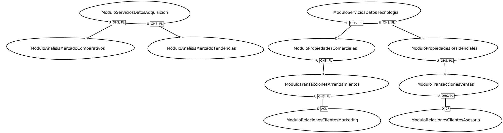
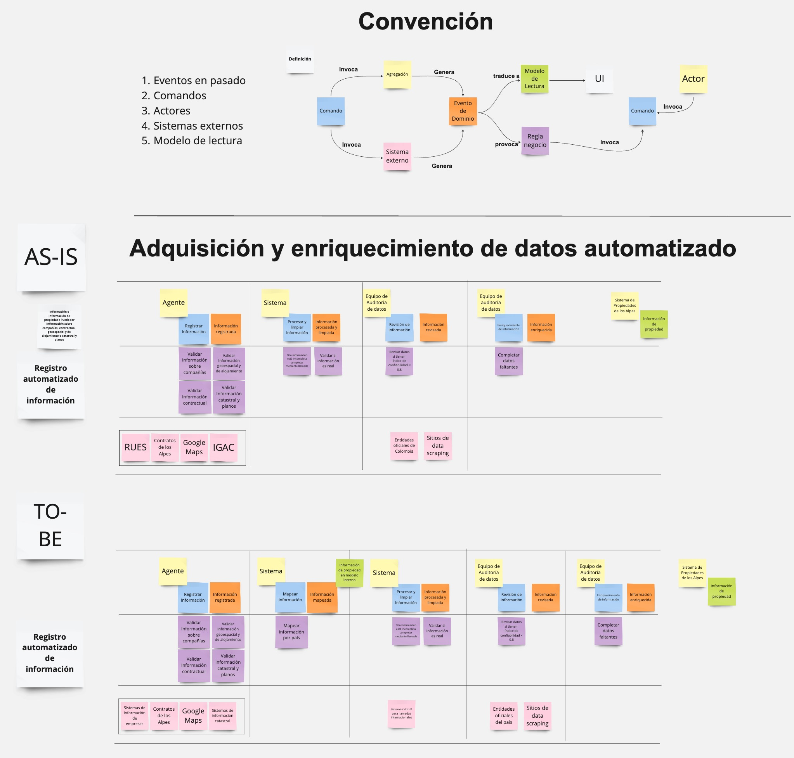
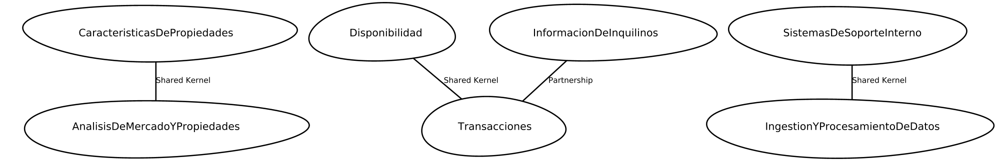
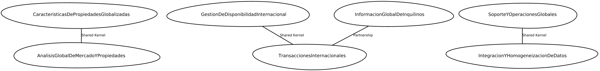

# ABC Jobs Apps - Non-Monolithic Approach

## Descripción
Este proyecto tiene como objetivo documentar el diseño para la problematica propiedades de los alpes
## Tecnologías Utilizadas
Contextmaper : solución que ofrece un lenguaje
específico de dominio (DSL por sus siglas en ingés, Domain Specific Language) que
expresa los patrones estratégicos de DDD dado que los lenguajes de descripción de
arquitectura existentes no apoyan suficientemente las pautas estratégicas del DDD

## Instalación y Configuración
Siga los pasos https://misw4406.github.io/docs/semana_1/tutorial_2/ para conocer el proceso de instalacion local o desarrollo en gitpod

## Estructura del poroyecto 

```
app/src/main/cml -> Contiene el codigo en contextmapper para la documentacion del proyecto 

app/src/main/cml/contextos -> contiene la definision de los contextos asis y tobe

app/src/main/cml/dominios-subdominios -> contiene la definicion de los dominios y subdominios dle proyecto 

app/src/main/cml/lenguaje-ubicuo -> contine la definicion del lenguaje ubicuo

gradle -> definicion de la herramienta de contruccion del proyecto

.gitpod.Dockerfile -> sste archivo se usa para definir un entorno Docker personalizado en Gitpod. Permite especificar las herramientas, los lenguajes de programación, las dependencias y las utilidades que deseas preinstalar en el entorno de desarrollo de Gitpod.

.gitpod.yml  -> archivo de configuración YAML para Gitpod. Aquí defines cómo Gitpod debería preparar tu entorno de desarrollo, lo que puede incluir la automatización de comandos al inicio, la configuración de puertos y otras integraciones específicas necesarias para tu proyecto.

```

## Entrega Semana 2


### Definicion Dominios y subdominios 
[Contexmapper dsl ](app/src/main/cml/dominios-subdominios/dominios-subdominions.cml)


### Definicion lenguaje Obicuo 




### Definicion de contextos:
#### ASIS
[Context Mapper ](app/src/main/cml/contextos/contextos-asis.cml)


#### TO-be
[Context Mapper ](app/src/main/cml/contextos/contextos-to-be.cml)


## Autores 
Hawer Forero h.foreror@uniandes.edu.co @hawerforerouniandes
Jael Rivera ja.riverao1@uniandes.edu.co @ja-rivera94
Jose Garay  j.garay@uniandes.edu.co @garayurbina-uniandes


## Licencia
Información sobre la licencia bajo la cual se distribuye el proyecto.
